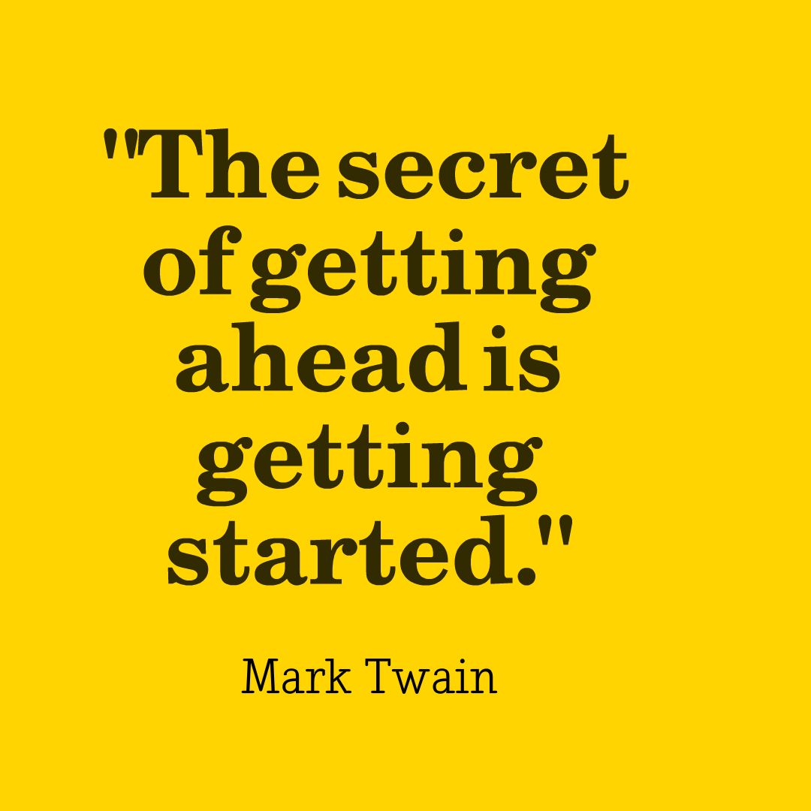

While on vacation last month I picked up this novel by Brandon Webb. It reminded me of another book I'd read earlier this summer, *Can't Hurt Me* by David Goggins. 

David Goggins' novel sharing a more intimate view of certain parts of his life and definitely with a tough love vibe, where as *Mastering Fear* addresses fear as the focal point and outlines a plan to keep your fear in check and how to use fear as a tool. 

One point Webb makes that really hits home is the idea that we can *fear to fail* but also we can *fear to succeed*. The idea that you may have a success that complicates your life so you just avoid it - that is real. There is a difference between not over-commiting yourself and being afraid of winning. 

The problem with fear is that it paralyzes most of us. And once you have given fear the driver's seat, wrestling it back is difficult. Taking risks is another topic he spends quite a bit of time on. I think of risk the opposite of fear so this makes sense. Taking risks is something we all crave even if we don't want to admit it to ourselves. And even if you think you don't want to take a risk. That itself is the risk!

Here's a great quote

> You're never safe.  [...]  
> Once you understand that complete safety will forever be out of your reach
> it frees you to embrace those risks that are worth it, and to do so with passion and abandon.

I love where the author emphasizes the need to "decide to decide." This sounds simple but is actually profound in how you approach every day. As with any book, the timing of when you read it can determine what you take away from the words you read. I'd recommend this one for anyone. 
